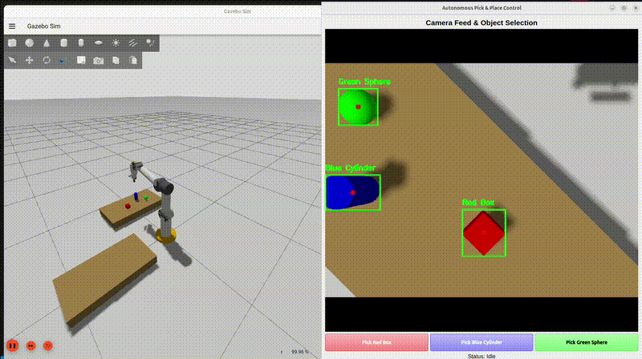
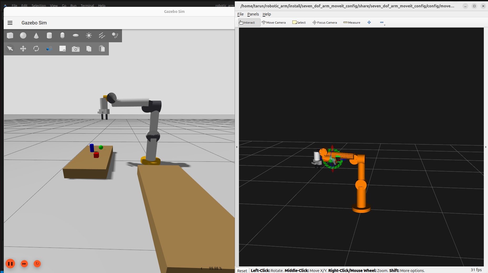
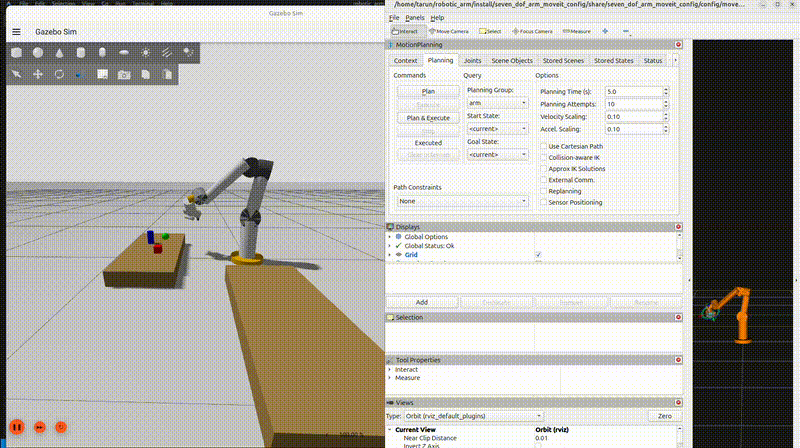

# ROS 2 7-DOF Pick and Place Pipeline

<p align="center">
  
</p>

This repository contains a simulation and control pipeline for a custom 7-DOF robotic arm using ROS 2 Jazzy and Gazebo Harmonic. It implements a closed-loop pick-and-place task using an eye-in-hand RGB-D camera and MoveIt 2 for motion planning.

##  Setup
The  robot is a 7-DOF manipulator.
- **Gripper**: Prismatic parallel-jaw gripper. Gazebo friction parameters (`mu1`, `mu2`) are tuned to handle primitive shapes like spheres without slipping.
- **Sensors**: RGB-D depth camera mounted on the gripper base for occlusion-free perception during the approach phase.

## Repository Structure
The workspace is split into three standard ROS 2 packages:
- `seven_dof_arm_description`: URDF/xacro files, meshes, and physics properties.
- `seven_dof_arm_gazebo`: Simulation launch files, world definitions, and the Python execution scripts (vision, state machine, GUI).
- `seven_dof_arm_moveit_config`: MoveIt 2 configuration, including SRDF, kinematics solvers, and OMPL planning parameters.

## Software Components

### Perception (`vision_grasp.py`)
Uses OpenCV to process the RGB-D feed from the wrist camera. It detects predefined objects (Red Box, Blue Cylinder, Green Sphere) using HSV color filtering and contour detection. The 2D pixel coordinates are deprojected into 3D space using the camera intrinsics, and the resulting target frames are broadcast via `tf2`.

### Execution Logic (`pick_and_place.py`)
A state machine that handles the sequence of moving to the object, descending, grasping, and dropping it off. 
- Uses the `/compute_ik` service from MoveIt to generate collision-free joint trajectories for Cartesian waypoints.
- Z-axis proximity checks between the TCP and target frame are used to trigger the grasp.
- Trajectory execution speeds are clamped to prevent dynamic objects from slipping out of the gripper due to inertia.

### Operator GUI (`gui_pick_place.py`)
A PyQt5 interface to interact with the system without using standard CLI tools. It displays a live `cv_bridge` feed and provides buttons to trigger pick-and-place routines as background subprocesses, keeping the main ROS executor responsive.

<p align="center">
  
</p>

## Usage

### 1. Build
```bash
cd ~/robotic_arm
source /opt/ros/jazzy/setup.bash
colcon build --symlink-install
```

### 2. Run the GUI Workflow
This launches the environment, spawns the robot, and opens the PyQt5 dashboard.
```bash
source install/setup.bash
ros2 launch seven_dof_arm_moveit_config autonomous_pick_place.launch.py
```
Click any object button in the GUI to start the sequence. The arm will scan, approach, grasp, and move the object to the drop-off table.

### 3. Manual MoveIt Planning
To test motion planning manually using RViz:
```bash
source install/setup.bash
ros2 launch seven_dof_arm_moveit_config demo.launch.py
```
Use the RViz MotionPlanning plugin to drag the interactive marker and execute paths.

<p align="center">
  
</p>
